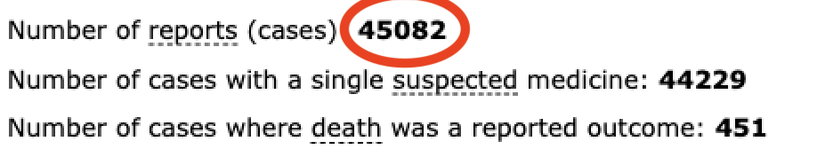

# DAEN Adverse Events Reports for Australian COVID-19 Injection rollout

DAEN's site for obtaining reports on medicine adverse event is slow, and sadly, if we were to depend on their built-in "Generate a PDF report" reporting function to run our own analysis, we are greeted with this error:

```
To improve performance for the large number of users searching DAEN Medicines,
PDF generation of search results has temporarily been disabled.

If you are querying DAEN in relation to Covid-19 vaccines, the TGA publishes a
weekly safety report that includes information about our analysis and
investigation of adverse event reports and other safety information.

Publication of an adverse event on DAEN does not mean that the vaccine or
medicine caused the event. Information on DAEN cannot be used to evaluate
whether a medicine or vaccine is safe.
```

But researchers aren't interested in a pre-masticated report.

In the name of all researchers out there, we are providing a WIP export from the beginning of time to the most current date possible of Australian COVID-19 vaccines adverse events data that we could find on the DAEN site.

We were able to locate 3 out of 4 approved vaccine data on the DAEN site. These include:

### SpikeVax

SpikeVax is known originally as Moderna vaccine.

### Comirnaty

Comirnaty is also known originally as Pfizer vaccine.

### AstraZeneca

Using the old name AstraZeneca as the new name Vaxzveria does not return any results on DAEN.

We believe the Novavax data is not available due to Novavax's late rollout.

<hr/>
For official information on which vaccines have been approved by [Australian Department of Health](https://www.health.gov.au/initiatives-and-programs/covid-19-vaccines/approved-vaccines)

<hr/>

# About the Data

The data in this repository comes from the Case Listings tab of the DAEN site.

For our first read:

- We search the Vaccine name
- Enter from the earliest to the latest available
- Go to the Case Listings tab
- Read the table through the pagination until the end.

For proceeding reads after that:

- We search the vaccine name
- Enter the last date recorded to the latest available
- Go to the Case Listings Tab
- Read the table through the pagination until the end

The data is mainly provided in a SQlite3 database that will be updated on this repository as new data is obtained.

[Sqlite3 Database](CaseListings.sqlite3)

#### Data Integrity

- The data is 'as is' from the DAEN site table format converted into JSON and SQlite database.
- Data is assumed to have unique case number values and therefore we treat the case number as the unique ID values. That way if duplicate case number are retreived it is assumed that both cases are the same report.

#### WIP - The following requires further investigation

- We have noticed that the number which DAEN reports in the heading of the table is not the total number of reports we are able to retrieve from the table. We are not sure why. It appears that they report a higher number (by about 200) than the table actually contains. We believe there may be missing cases or not all cases are retrieved from the table. If another set of eyes is able to confirm it would be appreciated.



### How can this data be used for good?

We believe all data that is publicly available should be made easy to search and analyse for public education.

